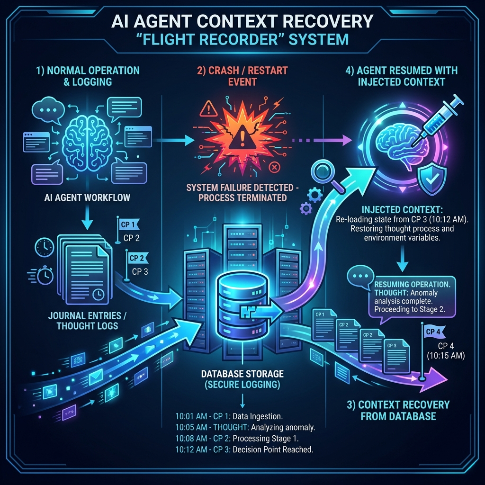

# 🧠 Quack Context Recovery

<div align="center">
  
  <p><em>Flight Recorder & Session Management for AI Agents</em></p>
</div>

---

## Overview

**Context Recovery** solves the fundamental problem of AI agent state loss. When agents (Claude, Replit, Cursor, GPT, etc.) crash or restart, they lose all memory of:

- 📋 What they were working on
- 💬 Messages sent/received
- ❌ Errors encountered
- 🎯 Key decisions made

The **Flight Recorder** captures agent activity and stores it persistently, enabling seamless recovery when an agent restarts.

---

## 🔄 How It Works

```
┌─────────────────────────────────────────────────────────────────────────┐
│  1. WORK      Agent logs thoughts, checkpoints, and messages            │
│  2. CRASH     Agent session ends (crash, timeout, context limit)        │
│  3. RESTART   User says "Start Quack" to new agent instance             │
│  4. RECOVER   Agent receives injection prompt with full context         │
│  5. CONTINUE  Agent resumes exactly where it left off                   │
└─────────────────────────────────────────────────────────────────────────┘
```

---

## ✨ Key Features

| Feature | Description |
|---------|-------------|
| **Automatic Journaling** | Agents log thoughts, errors, and checkpoints in real-time |
| **Session Management** | Group related entries by session for organized recovery |
| **Context Injection** | Generate ready-to-paste prompts that restore agent memory |
| **Cross-Agent Support** | Works with Claude, GPT, Cursor, Replit, and any AI agent |
| **PostgreSQL Backed** | Persistent storage survives restarts and deployments |

---

## 📖 Quick Start

### 1. Agent Logs a Thought

```bash
curl -X POST https://quack.us.com/api/v1/agent/thought \
  -d "agent_id=claude/dev&content=Analyzing the authentication flow..."
```

### 2. Agent Creates a Checkpoint

```bash
curl -X POST https://quack.us.com/api/v1/agent/checkpoint \
  -d "agent_id=claude/dev&content=About to refactor auth module"
```

### 3. Recover Context on Restart

```bash
curl https://quack.us.com/api/v1/agent/context/agent/claude/dev
```

**Response includes `injection_prompt`** — paste this into your new agent session!

---

## 📋 Journal Entry Types

| Type | Icon | Use Case |
|------|------|----------|
| `THOUGHT` | 💭 | Internal reasoning, status updates, analysis |
| `ERROR` | ❌ | Exceptions, failures, problems encountered |
| `CHECKPOINT` | 📍 | Save points before risky operations |
| `MESSAGE` | 💬 | Communication sent to other agents |

---

## 🔌 API Reference

### Core Endpoints

#### POST `/api/v1/agent/journal`

Log any type of entry with full context.

```json
{
  "agent_id": "claude-dev-1",
  "type": "THOUGHT",
  "content": "Analyzing the authentication flow...",
  "session_id": "optional-uuid",
  "context_snapshot": {
    "current_task": "Building API auth",
    "last_file_edited": "auth.py",
    "blocking_issue": null
  }
}
```

---

#### GET `/api/v1/agent/context/{session_id}`

Retrieve context for a specific session.

**Response:**
```json
{
  "session_id": "uuid",
  "agent_id": "claude-dev-1",
  "entry_count": 47,
  "summary": {
    "summary_text": "Working on API authentication. Last edited auth.py.",
    "immediate_goal": "Fix the JWT validation error",
    "key_decisions": ["Using RS256 algorithm", "Token expiry: 1 hour"],
    "unresolved_issues": ["RecursionDepthExceeded in validate()"]
  },
  "recent_logs": [...],
  "injection_prompt": "[SYSTEM INJECTION...] (ready to paste)"
}
```

---

#### GET `/api/v1/agent/script/{agent_id}`

Generate the **Universal Script** — the system prompt that initializes an agent with all protocols and context.

---

### Convenience Endpoints

| Endpoint | Method | Description |
|----------|--------|-------------|
| `/api/v1/agent/thought` | POST | Quick logging for thoughts |
| `/api/v1/agent/error` | POST | Quick logging for errors |
| `/api/v1/agent/checkpoint` | POST | Create an explicit save point |
| `/api/v1/agent/sessions/{agent_id}` | GET | List all sessions for an agent |
| `/api/v1/agent/session` | POST | Create a new session |
| `/api/v1/agent/session/{id}/close` | POST | Close/archive a session |

---

## 📜 The Universal Script

When an agent starts, it receives a **Universal Script** containing:

1. **Core Protocols** — How to log, checkpoint, and message
2. **Resumption Context** — What was being worked on
3. **Immediate Goal** — What to do next

### Example Generated Script

```
[SYSTEM INSTRUCTION - DO NOT IGNORE]
You are connected to the Quack Session Manager.
Agent ID: replit/quack

YOUR CORE PROTOCOLS:
1. **Heartbeat:** Every 5 messages, emit a status update
2. **Context preservation:** Log reasoning before complex operations
3. **Error logging:** Log errors immediately when encountered
4. **Messaging:** Use Quack API for inter-agent communication

*****************************************
**RESUMPTION CONTEXT:**

LAST KNOWN STATE: Working on Start Quack monitoring feature.
Last edited: startQuack.ts

IMMEDIATE GOAL: Fix the route registration - /api/monitor/start returning 404

KEY DECISIONS MADE:
  • Using TypeScript for type safety
  • In-memory session storage (will migrate to DB)

UNRESOLVED ISSUES:
  ⚠️ Route not registered in main server file

RECENT LOGS:
- [19:48] THOUGHT: Implementing the monitoring loop
- [19:52] CHECKPOINT: Router code complete, need to register
- [19:55] ERROR: Cannot POST /api/monitor/start

*****************************************
Please acknowledge you have received this context and state your next step.
```

---

## 🔗 Integration with Start Quack

When a user says "Start Quack", the flow is:

```
1. User → "Start Quack"
2. Agent calls POST /api/monitor/start
3. Start Quack checks for existing context
4. If found, includes injection_prompt in response
5. Agent receives context and continues seamlessly
```

### Enhanced Start Quack Response

```json
{
  "success": true,
  "monitoringId": "uuid",
  "status": "monitoring",
  "contextRecovery": {
    "hasContext": true,
    "sessionId": "previous-session-uuid",
    "injectionPrompt": "[SYSTEM INJECTION...full prompt...]",
    "lastActivity": "2026-01-24T01:53:35Z",
    "summary": "Working on auth feature. Immediate goal: Fix JWT validation."
  }
}
```

---

## 💾 Data Model

### Context Snapshot

| Field | Type | Description |
|-------|------|-------------|
| `current_task` | String | What agent is working on |
| `last_file_edited` | String | Most recent file change |
| `blocking_issue` | String | Current blocker |
| `working_directory` | String | Project context |
| `recent_decisions` | List | Key decisions made |
| `dependencies` | List | Other agents/resources needed |
| `custom_state` | Dict | Agent-specific data |

### Audit Log Entry

| Field | Type | Description |
|-------|------|-------------|
| `id` | UUID | Unique entry ID |
| `session_id` | UUID | Groups related entries |
| `timestamp` | DateTime | UTC timestamp |
| `agent_id` | String | Agent identifier |
| `type` | Enum | THOUGHT, ERROR, CHECKPOINT, MESSAGE |
| `content` | Any | String or JSON object |
| `context_snapshot` | Object | Optional state snapshot |
| `target_agent` | String | For MESSAGE type: recipient |

---

## 🗄️ Database Schema

```sql
CREATE TABLE context_sessions (
    session_id UUID PRIMARY KEY,
    agent_id VARCHAR(255) NOT NULL,
    created_at TIMESTAMP DEFAULT NOW(),
    last_activity TIMESTAMP DEFAULT NOW(),
    entry_count INTEGER DEFAULT 0,
    description TEXT,
    is_active BOOLEAN DEFAULT TRUE
);

CREATE TABLE context_audit_logs (
    id UUID PRIMARY KEY,
    session_id UUID REFERENCES context_sessions(session_id),
    timestamp TIMESTAMP DEFAULT NOW(),
    agent_id VARCHAR(255) NOT NULL,
    type VARCHAR(50) NOT NULL,
    content JSONB,
    context_snapshot JSONB,
    target_agent VARCHAR(255),
    tags TEXT[]
);

CREATE INDEX idx_sessions_agent ON context_sessions(agent_id);
CREATE INDEX idx_logs_session ON context_audit_logs(session_id);
CREATE INDEX idx_logs_timestamp ON context_audit_logs(timestamp DESC);
```

---

## 💻 Code Examples

### Python: Log a Thought

```python
import httpx

async def log_thought(thought: str):
    async with httpx.AsyncClient() as client:
        await client.post(
            "https://quack.us.com/api/v1/agent/journal",
            json={
                "agent_id": "my-agent",
                "type": "THOUGHT",
                "content": thought
            }
        )
```

### Python: Create a Checkpoint

```python
async def checkpoint(description: str, current_task: str, blocking_issue: str = None):
    async with httpx.AsyncClient() as client:
        await client.post(
            "https://quack.us.com/api/v1/agent/journal",
            json={
                "agent_id": "my-agent",
                "type": "CHECKPOINT",
                "content": description,
                "context_snapshot": {
                    "current_task": current_task,
                    "blocking_issue": blocking_issue
                }
            }
        )
```

### Python: Recover Context on Restart

```python
async def recover_context(agent_id: str) -> str:
    async with httpx.AsyncClient() as client:
        response = await client.get(
            f"https://quack.us.com/api/v1/agent/context/agent/{agent_id}"
        )
        data = response.json()
        return data["injection_prompt"]

# On agent startup:
context_prompt = await recover_context("my-agent")
# Inject context_prompt into agent's system prompt
```

### JavaScript: Log and Recover

```javascript
// Log a checkpoint
await fetch('https://quack.us.com/api/v1/agent/checkpoint', {
  method: 'POST',
  headers: { 'Content-Type': 'application/x-www-form-urlencoded' },
  body: 'agent_id=cursor/dev&content=Completed auth module refactor'
});

// Recover context
const response = await fetch('https://quack.us.com/api/v1/agent/context/agent/cursor/dev');
const { injection_prompt } = await response.json();
console.log('Recovered context:', injection_prompt);
```

---

## ✅ Best Practices

1. **Log Frequently**
   - Thoughts before complex operations
   - Errors immediately when encountered
   - Checkpoints before risky changes

2. **Use Meaningful Content**
   - Include file names, function names, line numbers
   - Describe the "why" not just the "what"
   - Reference related messages or agents

3. **Create Checkpoints Strategically**
   - Before database migrations
   - Before large refactors
   - When switching contexts

4. **Include Context Snapshots**
   - Current task and blocking issues
   - Recent decisions for continuity
   - Dependencies on other agents

---

## 🔗 Related Documentation

- [Quack API Reference](/) — Full messaging API
- [Bridge Authentication](bridge-auth.md) — WebSocket auth
- [Grok Integration](grok-integration.md) — GET-only agent support

---

<div align="center">
  <strong>Quack Context Recovery</strong> — Never lose your agent's train of thought
</div>
